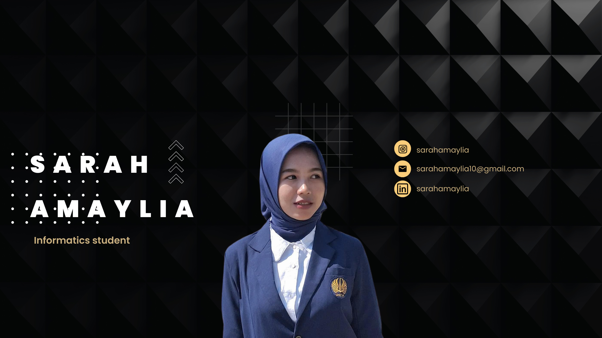

Hi, I'm **Sarah** — Informatics student at **State University of Surabaya (UNESA)**  
💻 Tech enthusiast | 💬 Public Speaker | 👑 Campus Ambassador | 🚀 Future Innovator

---

🔍 **About Me**  
I'm a passionate student who blends **technology, communication, and leadership**. I believe in creating meaningful solutions with empathy, collaboration, and purpose.

🛠️ **Tech Skills & Learning**  
- Programming in **Python** & **Java** for coursework and real-world projects  
- Web development through **RevoU** and **practitioner-led classes**  
- Building dynamic websites using HTML, CSS, JavaScript, and modern frameworks  
- Active in campus **IT Division** for Student & Alumni Forum — connecting ideas with action  

🌐 **Highlight Project**  
**Eco-Brick Digital** — a web-based system to exchange plastic waste into eco-friendly building materials.  
Focus: **Sustainability, digital tracking, and community empowerment.**

🎤 **Beyond Code**  
- Skilled in **public speaking**, moderating discussions, and leading group collaborations  
- Experienced **Master of Ceremony** for campus and city-wide events  
- Enjoy discussing social issues, ideating solutions, and empowering youth voices  

👑 **Leadership & Involvement**  
- 💼 Head of Public Relations – Informatics Student Council  
- 💡 Tech Ambassador & “Putri Kampus” – Representing innovation with elegance  
- 🤝 Member of IT Division – Citywide Student & Alumni Forum  
- 🎓 Participant in seminars like **Dicoding**, tech bootcamps, and collaborative workshops  

---

📣 **Let’s Collaborate!**  
I’m open to:  
✅ Internship opportunities (MSIB-ready!)  
✅ Creative collaborations on social-tech projects  
✅ Building impactful platforms with heart & purpose

> 🌍 *"Code with purpose, design with empathy, speak with impact."*

📫 Reach out:  
[LinkedIn](www.linkedin.com/in/sarah-amaylia-a960a92aa)
[Email](mailto:sarahamaylai10@gmail.com)
